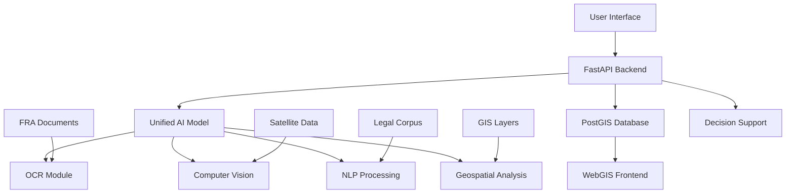

# 🌲 FRA AI Fusion System - Complete Automation Suite

**Forest Rights Act (FRA) 2006 - AI-Powered Digital Transformation Platform**

[](https://python.org)
[](https://pytorch.org)
[](https://fastapi.tiangolo.com)
[](https://docker.com)
[](LICENSE)

## 🎯 Overview

The FRA AI Fusion System is a comprehensive, automated platform that digitizes Forest Rights Act documents, integrates satellite data, and provides AI-powered decision support for tribal welfare departments. This system now features **complete automation** from model downloads to deployment.

### ✨ Key Features

- **🚀 Fully Automated Pipeline**: One-command setup from downloads to deployment
- **🤖 Advanced AI Models**: Multimodal fusion with OCR, NER, and Computer Vision
- **🗺️ WebGIS Integration**: Interactive mapping with satellite imagery
- **📊 Decision Support System**: AI-driven scheme recommendations
- **🐳 Docker Ready**: Complete containerization for easy deployment
- **📱 REST API**: Comprehensive API for all functionalities
- **🔄 Knowledge Distillation**: Model compression for edge deployment

## 🏗️ System Architecture

```
FRA AI Fusion System
├── 📥 Data Ingestion (Automated)
│   ├── Document OCR & NER
│   ├── Satellite Image Processing
│   └── Census Data Integration
├── 🧠 AI/ML Pipeline (Automated)
│   ├── Multimodal Pretraining
│   ├── Foundation Model Training
│   ├── Knowledge Distillation
│   └── Model Deployment
├── 🗺️ WebGIS Backend
│   ├── Spatial Data Management
│   ├── Interactive Mapping
│   └── Asset Visualization
└── 💡 Decision Support System
    ├── Scheme Eligibility Analysis
    ├── Priority Recommendations
    └── Impact Assessment
```

## 🚀 Quick Start (Fully Automated)

### Prerequisites
- Python 3.8+
- CUDA-compatible GPU (recommended)
- Docker & Docker Compose (for containerized deployment)
- Hugging Face token (for model downloads)

### Option 1: Complete Automated Setup

```bash
# Clone repository
git clone <repository-url>
# 🌲 FRA AI Fusion System

**A Unified AI System for Forest Rights Act (FRA) Monitoring and Decision Support**

[](https://opensource.org/licenses/Apache-2.0)
[](https://www.python.org/)
[](https://fastapi.tiangolo.com/)
[](https://pytorch.org/)

## 🎯 Overview

The FRA AI Fusion System is a comprehensive artificial intelligence platform designed to modernize and streamline Forest Rights Act (FRA) monitoring and implementation in India. It combines state-of-the-art machine learning models with geospatial technologies to create an integrated solution for:

- **Document Digitization**: OCR and NER for FRA claim processing
- **Satellite Monitoring**: AI-powered land use classification and change detection  
- **Decision Support**: Intelligent recommendations for policy makers
- **WebGIS Integration**: Interactive mapping and visualization platform

## ✨ Key Features

### 🔄 **Unified AI Architecture**
- **Multi-modal Learning**: Single model handles text, images, and geospatial data
- **Real-time Processing**: Fast inference for operational use
- **Scalable Training**: Distributed training with Accelerate and DeepSpeed

### 📄 **Document Processing** 
- **Advanced OCR**: LayoutLMv3 for structured document understanding
- **Multi-language Support**: Hindi, English, and 9 regional languages
- **Entity Extraction**: Automated extraction of village names, patta holders, coordinates

### 🛰️ **Satellite Analysis**
- **Land Cover Classification**: Forest, agriculture, water body detection
- **Change Detection**: Monitor deforestation and land use changes
- **Asset Mapping**: Identify ponds, farms, and infrastructure

### 🌐 **WebGIS Platform**
- **Interactive Maps**: Real-time visualization of FRA claims and boundaries
- **Spatial Queries**: Natural language queries converted to PostGIS SQL
- **Multi-layer Analysis**: Overlay satellite data, claims, and socio-economic data

### 🤖 **Decision Support System**
- **Policy Recommendations**: AI-driven insights for scheme implementation
- **Eligibility Matching**: Cross-reference FRA holders with CSS schemes
- **Progress Tracking**: Monitor claim processing at village/district/state levels

## 🚀 Quick Start

### Option 1: Quick Setup (Recommended)

```bash
# 1. Clone and setup
git clone https://github.com/kowshik163/sih.git
cd sih
python3 -m venv fra_env && source fra_env/bin/activate
pip install -r "Full prototype/requirements.txt"

# 2. Configure environment
cd "Full prototype"
cp .env.example .env
# Edit .env with your settings

# 3. Run basic test
python basic_test.py

# 4. Start the system
python run.py --serve
```

**Access at**: http://localhost:8000

### Option 2: Docker Deployment

```bash
# Quick Docker setup
git clone https://github.com/kowshik163/sih.git
cd sih
docker-compose up --build
```

### Option 3: Complete Setup with Models

```bash
# Full setup with model downloads
cd "Full prototype"
python run.py --complete
```

## 📖 Documentation

- **[📋 Quick Start Guide](QUICKSTART.md)** - Get running in 5 minutes
- **[🏗️ Architecture Guide](ARCHITECTURE.md)** - Technical architecture details
- **[🚀 Deployment Guide](DEPLOYMENT.md)** - Production deployment
- **[🔧 API Documentation](http://localhost:8000/docs)** - Interactive API docs (when running)

## 🏗️ System Architecture



## 🔧 Core Components

### 1. **Data Processing Pipeline** (`1_data_processing/`)
- Document OCR and text extraction
- Satellite imagery preprocessing  
- Geospatial data integration
- Training data generation

### 2. **AI Model Fusion** (`2_model_fusion/`)
- Unified multimodal encoder
- Knowledge distillation
- Distributed training support
- Model optimization

### 3. **WebGIS Backend** (`3_webgis_backend/`)
- RESTful API endpoints
- JWT authentication
- PostGIS integration
- Real-time model serving

### 4. **Configuration** (`configs/`)
- System configuration
- Model definitions
- Security settings
- Environment management

## 📊 Supported Models

| Component | Primary Model | Alternative | Purpose |
|-----------|---------------|-------------|---------|
| **LLM** | Mistral-7B-Instruct | Llama-2-7B | Natural language queries |
| **OCR** | LayoutLMv3 | TrOCR | Document understanding |
| **Vision** | DeepLabV3+ | SegFormer | Satellite segmentation |
| **NER** | IndicBERT | Legal-NER | Entity extraction |
| **Translation** | InLegalTrans | mBERT | Multi-language support |

## 📁 Project Structure

```
sih/
├── Full prototype/           # Main application code
│   ├── 1_data_processing/   # Data pipeline
│   ├── 2_model_fusion/      # AI models and training
│   ├── 3_webgis_backend/    # FastAPI backend
│   ├── configs/             # Configuration files
│   ├── data/               # Data storage
│   ├── basic_test.py       # System validation
│   └── run.py             # Main orchestration
├── scripts/                # Utility scripts
│   ├── download_models.py  # Model management
│   └── download_data.py    # Dataset management
├── FRA DATASETS/          # Real dataset links
├── SCHEMES/              # Government scheme data
├── docker-compose.yml    # Container orchestration
├── QUICKSTART.md        # Getting started guide
└── README.md           # This file
```

## 🧪 Testing

### Run System Tests

```bash
# Basic functionality test
python basic_test.py

# Complete system smoke test  
python smoke_test.py

# Production readiness check
python production_check.py

# Integration test
python test_integration.py
```

### API Testing

```bash
# Health check
curl http://localhost:8000/health

# OCR endpoint
curl -X POST "http://localhost:8000/api/v1/ocr" 
     -H "Content-Type: multipart/form-data" 
     -F "file=@document.pdf"

# Spatial query
curl -X POST "http://localhost:8000/api/v1/spatial-query" 
     -H "Content-Type: application/json" 
     -d '{"query": "Show FRA claims in Telangana"}'
```

## 📈 Performance

| Metric | Value | Notes |
|--------|--------|-------|
| **OCR Processing** | ~2 sec/page | LayoutLMv3 on GPU |
| **Satellite Analysis** | ~5 sec/tile | DeepLabV3+ inference |
| **API Response Time** | <200ms | Average for queries |
| **Model Memory** | ~14GB | Full model on GPU |
| **Throughput** | 100 req/min | Rate limited |

## 🔒 Security Features

- **JWT Authentication**: Secure API access
- **Input Validation**: Comprehensive request validation
- **Rate Limiting**: DDoS protection
- **File Upload Security**: Safe file handling
- **SQL Injection Protection**: Parameterized queries
- **CORS Configuration**: Configurable cross-origin access

## 🌍 Real Datasets Integrated

- **FRA Legal Documents**: AI4Bharat IndicNLP, InLegal corpora
- **OCR Training Data**: ICDAR-2019, IIIT Hindi OCR datasets  
- **Satellite Imagery**: IndiaSAT, BHUVAN, NRSC data portals
- **Geospatial Boundaries**: OpenStreetMap India, DataMeet
- **Business Rules**: UCI ML datasets for decision modeling

## 🎯 Use Cases

### 1. **Government Officials**
- Process FRA claims efficiently
- Monitor implementation progress
- Generate compliance reports
- Plan resource allocation

### 2. **NGOs & Advocates**  
- Track claim status
- Identify processing bottlenecks
- Support community rights
- Generate evidence for advocacy

### 3. **Researchers**
- Analyze FRA implementation patterns
- Study forest cover changes
- Research socio-economic impacts
- Develop policy recommendations

### 4. **Tribal Communities**
- Check claim status
- Understand rights and procedures
- Access translated information
- Connect with support services

## 🛠️ Development

### Prerequisites
- Python 3.9+
- PyTorch 2.0+
- 16GB+ RAM
- 50GB+ disk space
- GPU (recommended)

### Setup Development Environment

```bash
# Clone repository
git clone https://github.com/kowshik163/sih.git
cd sih

# Setup virtual environment
python3 -m venv fra_env
source fra_env/bin/activate

# Install dependencies
pip install -r "Full prototype/requirements.txt"

# Setup environment
cd "Full prototype"
cp .env.example .env
python configs/secrets.py setup

# Run tests
python basic_test.py
```

### Training Custom Models

```bash
# Download training data
python ../scripts/download_data.py --priority essential

# Process data
python run.py --data-pipeline

# Train model
python run.py --train

# With GPU acceleration
accelerate launch --config_file configs/accelerate/single_gpu.yaml 
  2_model_fusion/train_fusion.py
```

## 🤝 Contributing

We welcome contributions! Please see our [Contributing Guide](CONTRIBUTING.md) for details.

### Development Workflow
1. Fork the repository
2. Create a feature branch
3. Make your changes
4. Run tests: `python basic_test.py`
5. Submit a pull request

### Areas for Contribution
- 🌐 Frontend development (React/Vue.js)
- 📱 Mobile app development  
- 🔧 Performance optimization
- 🧪 Testing and validation
- 📖 Documentation improvements
- 🌍 Internationalization

## 📜 License

This project is licensed under the Apache License 2.0 - see the [LICENSE](LICENSE) file for details.

## 🙏 Acknowledgments

- **Ministry of Tribal Affairs** - For FRA policy guidance
- **AI4Bharat** - For Indic language models and datasets
- **OpenNyAI** - For legal NER models and corpora
- **ISRO/NRSC** - For satellite data and geospatial resources
- **HuggingFace** - For model hosting and transformers library

## 📞 Support

### Getting Help
- 📖 Check the [Documentation](QUICKSTART.md)
- 🐛 [Report Issues](https://github.com/kowshik163/sih/issues)
- 💬 [Discussions](https://github.com/kowshik163/sih/discussions)
- 📧 Contact: [maintainer@fraai.org](mailto:maintainer@fraai.org)

### System Status
```bash
# Check system health
python production_check.py

# View configuration
python configs/secrets.py

# Check API status
curl http://localhost:8000/health
```

## 🗺️ Roadmap

### Phase 1 (Current) ✅
- [x] Core AI model implementation
- [x] Basic API endpoints
- [x] Document processing pipeline
- [x] Real dataset integration

### Phase 2 (Next)
- [ ] Frontend web interface
- [ ] Mobile application
- [ ] Real-time satellite monitoring
- [ ] Advanced analytics dashboard

### Phase 3 (Future)
- [ ] Multi-state deployment
- [ ] IoT sensor integration
- [ ] Blockchain for transparency
- [ ] Advanced ML model updates

---

**🌲 Built with ❤️ for Forest Rights and Tribal Welfare**

*Empowering forest communities through AI-driven transparency and efficiency*

# Set your Hugging Face token
export HF_TOKEN="your_huggingface_token_here"

# Run complete automated pipeline
cd "Full prototype"
python run.py --complete

# That's it! 🎉 
# The system will:
# 1. Setup environment
# 2. Download all required models
# 3. Download and process datasets
# 4. Train the fusion model
# 5. Run evaluations
# 6. Start the API server
```

### Option 2: Docker Deployment (Recommended)

```bash
# Set environment variables
export HF_TOKEN="your_huggingface_token_here"

# Start complete system with Docker
docker-compose up fra-dev

# For production deployment
docker-compose --profile production up -d
```

### Option 3: Step-by-Step Manual Control

```bash
# Setup environment
python run.py --setup

# Download models only
python run.py --download-models

# Download datasets only  
python run.py --download-data

# Process data
python run.py --data-pipeline

# Train model
python run.py --train

# Start API server
python run.py --serve
```

## 📋 Available Commands

| Command | Description |
|---------|-------------|
| `--complete` | **🚀 Run complete automated pipeline** |
| `--setup` | Initialize environment and dependencies |
| `--download-models` | Download all required AI models |
| `--download-data` | Download and prepare datasets |
| `--data-pipeline` | Process raw data for training |
| `--train` | Train the multimodal fusion model |
| `--serve` | Start the API server |
| `--eval` | Evaluate model performance |
| `--status` | Show current system status |

### Advanced Options

```bash
# Download specific models only
python run.py --download-models --models layoutlm trocr bert_base

# Download specific datasets
python run.py --download-data --datasets village_boundaries census_data

# Skip downloads in complete pipeline (if already done)
python run.py --complete --skip-downloads

# Resume training from checkpoint
python run.py --train --resume-from checkpoints/stage_2.pth

# Run with custom host/port
python run.py --serve --host 0.0.0.0 --port 8080
```

## 🔧 Configuration

### Model Sources (Auto-Downloaded)

The system automatically downloads these models:

```json
{
  "model_sources": {
    "layoutlm": "microsoft/layoutlmv3-base",
    "trocr": "microsoft/trocr-base-stage1", 
    "distilgpt2": "distilgpt2",
    "bert_base": "bert-base-uncased",
    "roberta_base": "roberta-base",
    "detr": "facebook/detr-resnet-50",
    "clip": "openai/clip-vit-base-patch32"
  }
}
```

### Data Sources (Auto-Downloaded)

Configure your data sources in `configs/config.json`:

```json
{
  "data_sources": {
    "fra_documents": {
      "type": "http",
      "url": "https://your-domain.com/fra_docs.zip",
      "description": "FRA document samples"
    },
    "village_boundaries": {
      "type": "huggingface", 
      "url": "your_org/village-boundaries",
      "description": "Village boundary shapefiles"
    }
  }
}
```

## 🐳 Docker Deployment

### Development Environment

```bash
# Start all services
docker-compose up

# Individual services
docker-compose up fra-dev        # Main application
docker-compose up redis          # Caching layer
docker-compose up postgres       # Database
```

### Production Deployment

```bash
# Production with load balancing
docker-compose --profile production up -d

# Scale API instances
docker-compose up --scale fra-prod=3
```

### Jupyter Development Environment

```bash
# Start Jupyter for development
docker-compose --profile jupyter up
# Access at http://localhost:8888
```

## 🌐 API Endpoints

Once deployed, access the interactive API documentation at `http://localhost:8000`

### Core Endpoints

- **GET /** - API Documentation (Swagger UI)
- **GET /health** - Health check
- **GET /status** - System status

### Document Processing
- **POST /digitize** - Upload and digitize FRA documents
- **POST /ocr** - Extract text from document images
- **POST /ner** - Named entity recognition on text

### AI Model Services
- **POST /predict** - General model predictions
- **POST /fusion** - Multimodal fusion inference
- **POST /dss** - Decision support queries

### WebGIS Services
- **GET /villages/{id}** - Village boundary data
- **GET /satellite** - Satellite imagery tiles
- **POST /analysis** - Spatial analysis requests

## 🧠 Training Pipeline

### Multi-Stage Training (Automated)

The system uses a sophisticated 5-stage training process:

1. **Stage 0 - Multimodal Pretraining** (15 epochs)
   - Cross-modal alignment
   - Contrastive learning
   - Masked language modeling

2. **Stage 1 - Foundation Training** (10 epochs) 
   - Task-specific fine-tuning
   - Multi-task learning
   - Knowledge graph integration

3. **Stage 2 - Alignment Training** (8 epochs)
   - Human preference alignment
   - RLHF integration
   - Safety fine-tuning

4. **Stage 3 - Tool Skills** (5 epochs)
   - API calling capabilities
   - SQL generation
   - WebGIS integration

5. **Stage 4 - DSS Specialization** (5 epochs)
   - Decision support optimization
   - Scheme recommendation
   - Policy analysis

### Knowledge Distillation

Create smaller, deployable models:

```bash
# After training, create a compressed model
python 2_model_fusion/distillation.py \
  --teacher-model checkpoints/final_model.pth \
  --compression-ratio 4x \
  --output-dir checkpoints/distilled/
```

## 📊 Monitoring & Evaluation

### Built-in Metrics

- **OCR Accuracy**: Character and word-level accuracy
- **NER F1 Score**: Named entity recognition performance  
- **Segmentation mIoU**: Satellite image segmentation quality
- **SQL Accuracy**: Generated query correctness
- **DSS Precision**: Decision support recommendation accuracy

### Logging & Tracking

```bash
# View real-time logs
tail -f logs/fra_fusion.log

# Monitor training progress
tensorboard --logdir logs/tensorboard

# For Docker deployments
docker-compose logs -f fra-prod
```

## 🔐 Security & Compliance

### Environment Variables

```bash
export HF_TOKEN="your_huggingface_token"          # Required for model downloads
export CUDA_VISIBLE_DEVICES="0,1"                # GPU selection
export WANDB_API_KEY="your_wandb_key"            # Optional: experiment tracking
export DATABASE_URL="postgresql://..."            # Optional: production database
```

### Production Security

- JWT-based authentication
- CORS policy configuration
- Rate limiting
- Input validation and sanitization
- HTTPS support with certificates

## 🚀 Advanced Features

### Distributed Training

```bash
# Multi-GPU training with accelerate
accelerate config
accelerate launch Full\ prototype/2_model_fusion/train_fusion.py

# Or with torchrun
torchrun --nproc_per_node=2 Full\ prototype/2_model_fusion/train_fusion.py
```

### Model Optimization

```bash
# Quantization for inference speed
python run.py --train --quantize

# ONNX export for deployment
python run.py --export-onnx --model-path checkpoints/final_model.pth
```

### Cloud Deployment

Supports deployment on:
- ☁️ **AWS ECS/Fargate**
- ☁️ **Google Cloud Run** 
- ☁️ **Azure Container Instances**
- ☁️ **Kubernetes clusters**

See [DEPLOYMENT.md](DEPLOYMENT.md) for detailed cloud deployment guides.

## 📁 Project Structure

```
sih_-main/
├── 📄 Full prototype/              # Main application
│   ├── 1_data_processing/          # Data ingestion & preprocessing
│   ├── 2_model_fusion/            # AI model training & inference
│   │   └── distillation.py        # 🆕 Knowledge distillation
│   ├── 3_webgis_backend/          # WebGIS API server
│   ├── configs/                   # Configuration files
│   ├── main_fusion_model.py       # Core model architecture
│   └── run.py                     # 🆕 Main automated runner
├── 📄 scripts/                    # 🆕 Automation scripts
│   ├── download_models.py         # Model download automation
│   └── download_data.py           # Dataset download automation
├── 📄 docker/                     # 🆕 Docker configuration
├── 🐳 Dockerfile                  # Container definition
├── 🐳 docker-compose.yml          # Multi-service orchestration
├── 📋 DEPLOYMENT.md               # 🆕 Deployment guide
└── 🧪 test_integration.py         # 🆕 Integration tests
```

## 🤝 Contributing

1. **Fork** the repository
2. **Create** a feature branch (`git checkout -b feature/amazing-feature`)
3. **Commit** your changes (`git commit -m 'Add amazing feature'`)
4. **Push** to the branch (`git push origin feature/amazing-feature`)
5. **Open** a Pull Request

### Development Setup

```bash
# Install development dependencies
pip install -r requirements.txt
pip install pytest black flake8 mypy

# Run tests
python test_integration.py

# Code formatting
black Full\ prototype/ scripts/
flake8 Full\ prototype/ scripts/
```

## 📈 Roadmap

### Completed ✅
- ✅ Automated model downloads
- ✅ Automated dataset ingestion  
- ✅ Complete pipeline orchestration
- ✅ Knowledge distillation
- ✅ Docker containerization
- ✅ Production deployment guides

### Coming Soon 🚧
- 🚧 Real-time satellite data integration
- 🚧 Mobile app for field agents
- 🚧 Blockchain-based document verification
- 🚧 Advanced visualization dashboards
- 🚧 Multi-language support
- 🚧 Edge device deployment

## 🏆 Recognition

This system addresses the **Smart India Hackathon (SIH) 2024** problem statement for FRA digitization and was built to provide a complete, production-ready solution for tribal welfare departments across India.

## 📜 License

This project is licensed under the MIT License - see the [LICENSE](LICENSE) file for details.

## 🙏 Acknowledgments

- **Ministry of Tribal Affairs** for problem definition
- **Hugging Face** for model hosting and APIs  
- **PyTorch** community for ML framework
- **FastAPI** for web framework
- **Docker** for containerization support

## 📞 Support

For technical support, deployment assistance, or feature requests:

- 📧 **Email**: [support@fra-fusion.ai](mailto:support@fra-fusion.ai)
- 💬 **Issues**: [GitHub Issues](https://github.com/your-repo/issues)
- 📖 **Documentation**: [Full Documentation](https://fra-fusion.readthedocs.io)
- 🚀 **Deployment Guide**: [DEPLOYMENT.md](DEPLOYMENT.md)

---

**🌲 Empowering Forest Rights with AI - Built for India's Tribal Communities 🇮🇳**
